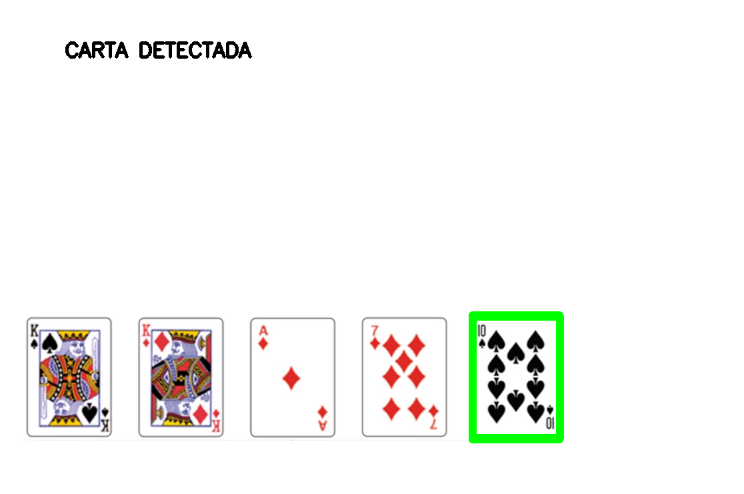
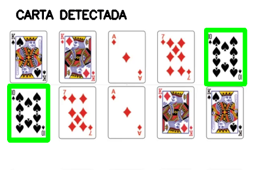

# NAC2 parte 1 Detecção de cartas

# Detecção de cartas

**nome dos alunos:** Adhemar Quispe Mamani

**Turma:** 4SIA

**Ano:** 4º ano

## Objetivo / descrição do Projeto

Detectar e contornar as cartas por naipe e depois somente a carta 10 de espadas

## Diagrama do projeto

Imagens do projeto funcionando

Detectando 1 carta

Detectando 2 ou mais cartas

## Como usar 

* Faça o download do projeto.
* Abra com o Visual Studio Code
* Faça a instalacao dos pactotes cv2 e numpy no CMD caso nao tenha, veja a seguir como fazer.
* pip install cv2
* pip install numpy
* Pronto, Run Python File

### Referências 

* [geeksforgeeks](https://www.geeksforgeeks.org/python-opencv-write-text-on-video/)
* [pyimagesearch](https://pyimagesearch.com/2021/03/22/opencv-template-matching-cv2-matchtemplate/)
* [opencv](https://docs.opencv.org/4.x/d4/dc6/tutorial_py_template_matching.html)
